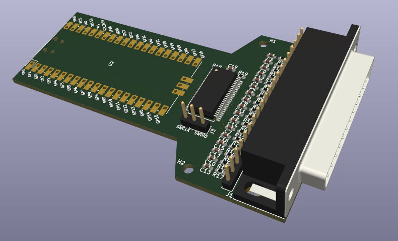
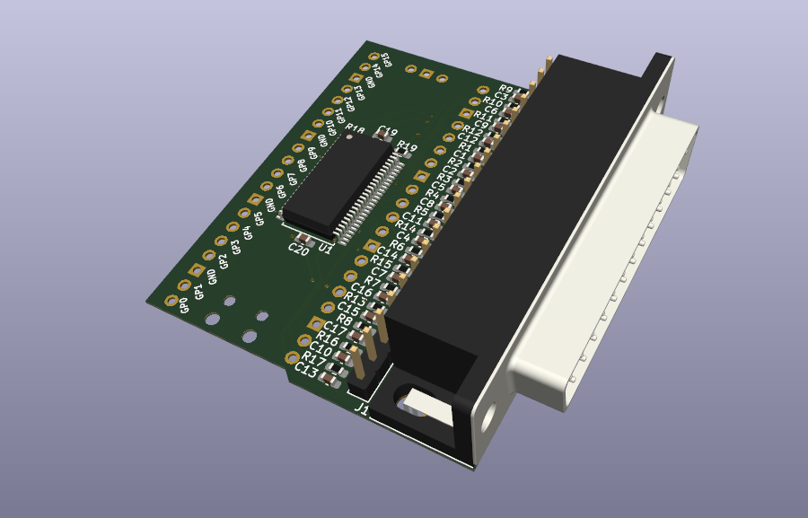
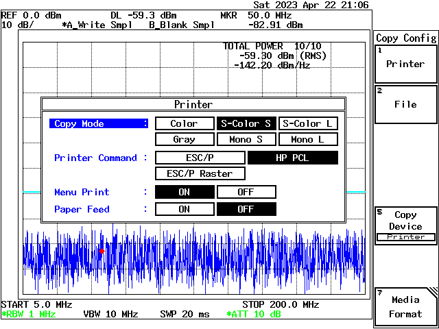

# Fake Parallel Printer

This repo contains the design files for the Fake Printer tool: a hardware
dongle with a DB-25 connector that plugs into the parallel printer port
that was available on nearly all computers and equipment in the eighties
and nineties.

Check out this blog post for a detailed description of the design,
and build and usage instructions:

* [Fake Parallel Printer - A Parallel Port Traffic Capturing Tool](https://tomverbeure.github.io/2023/01/24/Fake-Parallel-Printer-Capture-Tool-HW.html)

There are 2 versions of the PCB. Revision 2 only uses 2 layers and doesn't
stick out as much out of the device in which is plugged in. It's probably
the best one to build. The firmware is designed to work for both PCB versions.

## PCB v1



* KiCAD database of the PCB: [`./parallel2usb_v1`](./parallel2usb_v1)
* [Schematic of PCB v1](./parallel2usb_v1/parallel2usb_v1_schematic.pdf)

## PCB v2

**WARNING: v2 hasn't been tested!!!**



* KiCAD database of the PCB: [`./parallel2usb_v2`](./parallel2usb_v2)
* [Schematic of PCB v2](./parallel2usb_v2/parallel2usb_v2_schematic.pdf)

A Digikey cart with all the components to populate version 2 of the PCB can
be found [here](https://www.digikey.com/short/mcb8vf27). Not all
resistors and capacitor must be populated though. Check out the blog
post for details.

## Firmware

[`parallel2usb_hd_on.uf2`](parallel2usb_hd_on.uf2) contains the compiled
firmware for the Raspberry Pico.

To make changes and recompile yourself:

* set the `PICO_SDK` environment variable to the path of your locally installed 
  [Raspberry Pico SDK](https://github.com/raspberrypi/pico-sdk).
* Build the code:


      mkdir -p ./c/build
      cd ./c/build
      cmake ..
      make

* If all goes well, a new `parallel2usb.uf2` will be waiting in
  `./c/build/parallel2usb`.

## Capturing Parallel Port Data

* Plug in the board into the host with the parallel port.
* Connect your PC to the board with a USB cable.
* Run `python3 ./fake_printer.py -p <USB serial device>` (Use -h for more options.)
* Issue a print operation on the host.
* A new file will be generated for each print operation

## Converting a Parallel Port Captured File

* PCL: use [Ghostscript](https://ghostscript.com/releases/gpcldnld.html)

    `~/tools/ghostpcl-10.0.0-linux-x86_64/gpcl6-1000-linux-x86_64 -dNOPAUSE -sOutputFile=output.png -sDEVICE=png256 -g8000x8000 -r600x600 print_cap.pcl`

* Epson ESC/P: use [PrinterToPDF](https://github.com/RWAP/PrinterToPDF)

    `/opt/printerToPDF/bin/printerToPDF -o output -f /opt/printerToPDF/lib/PrinterToPDF/font2/Epson-Standard.C16 print_cap.esc_p`

* Encapsulated Postscript: use Inkscape

    `inkscape -f ./print_cap.eps -w 1280 -y=255 -e output.png`

# Conversions

* HP Infinium

```
fake_printer.py --port=/dev/ttyACM0 -t 2 -v --prefix=hp_osc_ -s eps
inkscape -f ./hp_osc_0.eps -w 1580 -y=255 -e hp_osc_0.png
convert hp_osc_0.png -crop 1294x971+142+80 hp_osc_0_cropped.png
```

* Advantest R3273

    * Config printer: Config -> Copy Config -> Printer: 

        

    * To print: Copy
    * To convert:

```
~/tools/ghostpcl-10.0.0-linux-x86_64/gpcl6-1000-linux-x86_64 -dNOPAUSE -sOutputFile=test.png -sDEVICE=png256 -g8000x8000 -r600x600 r3273_0.pcl
convert test.png -filter point -resize 2000  test2.png
convert test2.png -crop 640x480+315+94 test3.png
```

